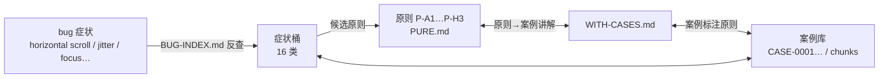

# Practical Web Design Principles ・ 网页设计原则实用汇总

> A curated, **actionable** collection of web design principles — layout, typography, color,
> motion, accessibility, design tokens — plus the new generation of **AI-agent design skills**.
> 精选可落地的网页设计原则与资源：从经典指南到 AI 时代的 Agent 设计技能。

  
  
  
  

---

## TL;DR

**Why this list / 为什么有这份列表**
Most "web design" lists are encyclopedic; this one is **practical-first**. Every entry answers:
"读完能不能立刻用到我的页面上？"（每条都标注 ★ 星数与其真正的用途。）

**Best for / 适合谁**
- Frontend devs building hand-rolled pages (zero-framework) — 手写页面的前端开发者
- AI-agent 时代的工作流：把原则变成 *skills* 交给 Claude Code / Cursor / Copilot

---

## 📑 Contents / 目录

1. [Classic Principles & Standards 经典原则与标准](#1-classic-principles--standards)
2. [Layout & Typography 版式与排版](#2-layout--typography)
3. [Design Tokens & Systems 设计令牌与体系](#3-design-tokens--systems)
4. [Checklists & Practice 清单与实战](#4-checklists--practice)
5. [AI-Agent Design Skills（2025-2026 新浪潮）](#5-ai-agent-design-skills)
6. [Our Principle System & Case Bank 自建原则体系与案例库（双向索引）](#6-our-principle-system--case-bank-自建原则体系与案例库双向索引)
7. [Contribute 贡献](#7-contribute)

---

## 1. Classic Principles & Standards

| Project | ★ | Why it's useful 为什么实用 |
|---|---|---|
| [w3ctag/design-principles](https://github.com/w3ctag/design-principles) | 224 | **Web 平台级设计原则**（W3C TAG）：隐私、安全、性能、可用性如何贯穿 API/规范设计——理解"平台怎么想" |
| [Heydon/principles-of-web-accessibility](https://github.com/Heydon/principles-of-web-accessibility) | 995 | **无障碍设计方法论**：用真实案例教你"测试驱动"地写可访问 UI，比 WCAG 文档更好读 |
| [keysjoao/laws-of-ux-skills](https://github.com/keysjoao/laws-of-ux-skills) | 2 | **30 条 UX 法则三件套**（advisor/audit/pre-ship checklist）：审查界面的即时可查表 |
| [fmhall/software-laws](https://github.com/fmhall/software-laws) | 6 | 软件与 UX 法则 skill 化：给 Agent 的"设计纪律" |

## 2. Layout & Typography

| Project | ★ | Why it's useful 为什么实用 |
|---|---|---|
| [nevertoday/350-layout-compositions](https://github.com/nevertoday/350-layout-compositions) | 743 | **350 种版面构图**：栅格、编辑排版、视觉原则全覆盖——"没有灵感时翻这张表" |
| [system-ui/theme-ui](https://github.com/system-ui/theme-ui) | 5395 | **约束驱动设计**：design tokens 直接约束组件渲染，所有"原则"最后都要落到 token 上 |
| [adrianhajdin/brainwave](https://github.com/adrianhajdin/brainwave) | 1874 | **现代着陆页参考实现**：parallax + bento 布局的完整代码（React + Tailwind），照抄结构即可"看起来像 2026 年" |

## 3. Design Tokens & Systems

| Project | ★ | Why it's useful 为什么实用 |
|---|---|---|
| [design-tokens/community-group](https://github.com/design-tokens/community-group) | 2113 | **DTCG 设计令牌规范**：色彩/字体/间距的行业标准格式，写进你的 CSS 变量之前先看它 |
| [sturobson/Awesome-Design-Tokens](https://github.com/sturobson/Awesome-Design-Tokens) | 1297 | 设计令牌资源大全：规范、工具、生成器一站收集 |

## 4. Checklists & Practice

| Project | ★ | Why it's useful 为什么实用 |
|---|---|---|
| [jgthms/web-design-in-4-minutes](https://github.com/jgthms/web-design-in-4-minutes) | 4382 | **4 分钟网页设计**：从白纸到"能看"的最小原则集，新手最快见效 |
| [drublic/checklist](https://github.com/drublic/checklist) | 282 | **前端 Checklist**：性能、可访问性、代码质量——交付前逐项过一遍 |
| [nicolesaidy/awesome-web-design](https://github.com/nicolesaidy/awesome-web-design) | 2769 | 设计资源精选总表：字体、色彩、工具、灵感站点 |

## 5. AI-Agent Design Skills

> 2025-2026 最活跃的新方向：把设计原则下沉为 **skill / MCP**，让 Agent 直接执行审查、出 token、改 UI。

| Project | ★ | Why it's useful 为什么实用 |
|---|---|---|
| [LottieFiles/motion-design-skill](https://github.com/LottieFiles/motion-design-skill) | 1524 | **动效原则 skill**：timing/easing/choreography + Disney 动画原则适配 UI——给 Agent 讲"怎么动得对" |
| [gnurio/refactoring-ui-plugin](https://github.com/gnurio/refactoring-ui-plugin) | 359 | **Refactoring UI 原则落地**：10 个 Claude/Cursor skills，把 AI 设计审查结构化（书是好书，这个免去你自己总结） |
| [marvkr/better-design](https://github.com/marvkr/better-design) | 227 | **开源设计 MCP**：31 套品牌级主题（Linear/Stripe/Vercel…）+ 设计令牌 + UI 原则 + WCAG 规则一条龙 |
| [trevorgrogers/ux-designer-skills](https://github.com/trevorgrogers/ux-designer-skills) | 4 | Claude Code 的 UX 设计师插件：Laws of UX + Nielsen 启发式 + WCAG + 设计系统 |

---

## ⚠️ Case Study / 实战案例：滚动条引发的"抖动"（2026-09）

一个真实踩坑记录 — 对应了上面哪条原则，以及哪些原则**没有**覆盖。

**现象**：页面在 Windows Chrome（经典滚动条）特定缩放（50%/80%/90%/100%）下滚到底时出现水平滚动条，出现/消失循环 → 页面 ±15px 抖动、末端导航高亮翻转（行程恰好 = 滚动条厚度）。

**映射到本清单的原则：**
- **已覆盖（设计层）**：WCAG 1.4.10 *Reflow*（缩放下不得出现水平滚动）→ Heydon 无障碍原则 / 清单 accessibility 类目；"约束式设计"（token 化间距、max-width:100% + min-width:0）→ theme-ui / 350-layout-compositions；"动效可中断"（动画让位于用户输入）→ motion-design-skill
- **未覆盖（实现层 — 本仓库的独特价值）**：
  1. **滚动监测逻辑不能假设 maxY 稳定**：经典滚动条出现/消失使 maxY 漂移约 15px，"距底阈值"型逻辑（scroll-spy 末端区）必须用**带宽 ≥ 阈值 + 双向迟滞**，或从源头消除水平溢出（overflow-x: clip）
  2. **测试环境 ≠ 实机**：无头浏览器的 Overlay 滚动条 & 固定 DPR 无法复现经典滚动条相关缺陷——本地"全绿"不等于实机正确，关键交互要在实机多缩放档验证

**修复**：根容器 overflow-x: clip + 导航换行护栏（消灭溢出源）；scroll-spy 用"阅读线 + 方向迟滞 + 宽末端区"吸收 maxY 漂移。[完整 issue 记录](https://github.com/eugenewang5425/eugenewang5425.github.io/issues/1)

---

## 6. Our Principle System & Case Bank 自建原则体系与案例库（双向索引）

> 把上面所有经典原则**综合成我们自己的 31 条**（P-A1…P-H3，8 组），并建立 **bug 案例库 ↔ 原则** 的双向索引：
> 设计层原则告诉你"不该发生什么"，案例库告诉你"实际怎么发生的、在什么环境发生的"。

**两个版本，随取随用：**

| 版本 | 文件 | 用途 |
|---|---|---|
| 🧼 **纯净原则版** | [principles/PURE.md](principles/PURE.md) | 31 条 = 一句陈述 + 一句执行规则。Code review 逐项过表 / 直接喂给 AI agent 当 rule |
| 📖 **原则+案例讲解版** | [principles/WITH-CASES.md](principles/WITH-CASES.md) | 每条原则挂真实案例（症状→根因→环境→修复→映射），含本项目 4 个实战案例全程记录 |

**双向搜索架构：**

- 🔍 **从 bug 找原则**（出 bug 时）：打开 [cases/BUG-INDEX.md](cases/BUG-INDEX.md) → 按症状关键词找桶 → 得到候选原则 + 同症状案例的环境记录
- 🔍 **从原则找案例**（做 review 时）：[PURE.md](principles/PURE.md) 逐条过 → [WITH-CASES.md](principles/WITH-CASES.md) 读案例 → [data/index.json](data/index.json) 机器可读全量映射
- 🌍 **环境标注是硬规则**：每个案例必须注明平台 / 浏览器 / 缩放或视口 / 技术栈——同一个 bug 在 Overlay 与经典滚动条、IAB 与桌面浏览器的答案完全不同

### 📡 Case Bank 采集进度（每轮 100 条公开 issue，匿名化入库）

<!-- ROUND:START -->
| Metric | Value |
|---|---|
| Rounds done | **54** (target: 100 rounds / 10,000 cases) |
| Cases collected | **5400** |
| Last round | +100 cases · 600 raw issues scanned |
| Top symptom buckets | media-cls(1387) · browser-quirk(1379) · form-input(1026) · ssr-hydration(969) · focus-a11y(682) · animation-motion(596) |
| Updated | 2026-09-05 · full index: [BUG-INDEX.md](cases/BUG-INDEX.md) |
<!-- ROUND:END -->

案例规则：保留**具体 bug、根因、修复与环境**；**不保留**任何来源信息（仓库名/issue 号/用户名/链接全部剥除）——来源仅以聚合清单形式列在 README 结尾。

## 7. Contribute

- 原则是**活的**：发现更好/更高星/更实用的项目 → [开 Issue](https://github.com/eugenewang5425/web-design-principles/issues) 或 PR
- 收录标准：**可执行性强**（读完 10 分钟内能改进页面）> 名气
- 🎯 排序按"实用优先"，星数仅供参考

---

## License & Acknowledgments

MIT（本目录内容）：清单与评注可自由使用；各项目版权归属其各自作者。

*Curated by [eugenewang5425](https://github.com/eugenewang5425) — GIS→Robotics 路上的前端实践。*

---

## Crawl Sources 采集来源清单

<!-- SOURCES:START -->
Aggregated crawl sources (repos whose public issues were mined and anonymized into the case bank).
Cases themselves carry **no** source identity — this list is the only place sources appear.

- facebook/react
- vuejs/core
- sveltejs/svelte
- angular/angular
- preactjs/preact
- solidjs/solid
- QwikDev/qwik
- alpinejs/alpine
- vercel/next.js
- nuxt/nuxt
<!-- SOURCES:END -->
